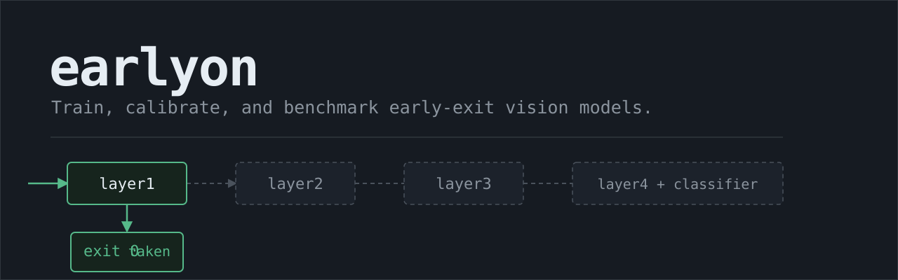

<p align="center">
  
</p>

<p align="center">
  <a href="https://github.com/sohams25/earlyon/actions/workflows/ci.yml"></a>
  
  
  
  <a href="https://pypi.org/project/earlyon/"></a>
  <a href="LICENSE"></a>
</p>

`earlyon` adds intermediate classifier heads to PyTorch vision models so
suitable inputs can stop before the full backbone runs. It includes
exit-head training, independent calibration for every head, threshold
selection, checkpoint migration, fair benchmarking and a reference staged
runtime.

Two things to know up front. Dynamic routing currently runs in eager
PyTorch. The standard ONNX export computes all exits and is not, by itself,
a conditional early-exit runtime. For supported architectures, the
reference staged runtime can genuinely skip later stages; it is
intentionally narrow and is not a universal model-partitioning system.

The primary target is batch-1, latency-sensitive inference; batched routing
exists but is conservative.

```python
import torch
from earlyon.models import resnet50_ee

# pretrained=True fetches ResNet50 ImageNet weights once (~100 MB)
model = resnet50_ee(num_classes=10, pretrained=True).eval()
result = model(torch.randn(1, 3, 224, 224), mode="inference")

result.exit_taken                        # which head answered; -1 = full network
result.estimated_backbone_flops_fraction # estimated fraction of backbone FLOPs
                                         # executed — not measured latency or energy
result.confidence                        # softmax confidence where it answered
```

<p align="center">
  
</p>

## Install

```bash
pip install earlyon==0.3.0
```

Or from the GitHub tag:

```bash
pip install git+https://github.com/sohams25/earlyon@v0.3.0
```

From source for development:

```bash
git clone https://github.com/sohams25/earlyon.git
cd earlyon
pip install -e ".[dev]"
```

Python 3.10+, torch 2.0+. `pretrained=True` downloads torchvision weights on
first use; the CIFAR-10 CLI commands download the dataset on first run.

## Why the full forward pass hurts

A deep network spends the same compute on every image. A frontal close-up of
a car and a blurry, half-occluded bird both pay for all fifty layers, even
though the car is decided after a handful of them. At batch size 1 on an
edge device, that flat cost is your latency and your power budget.

The idea has been in the literature for years: BranchyNet in 2016, then
eight years of follow-ups collected in a 2024 ACM survey (10.1145/3698767)
reporting 1.3 to 2.5× *estimated compute* savings at single-sample edge
inference. Each paper ships custom code for one architecture; earlyon is an
installable toolkit for the same idea — and its own benchmark below shows
that estimated savings do not automatically become wall-clock savings.

## What it does

Built-in factories are provided for the documented architectures. A custom
wrapper is also available when the model's intermediate features, input
signature and classifier outputs can be identified.

| Factory | Backbone | Exits |
|---|---|---|
| `resnet18_ee` | torchvision ResNet18 | 2 (after `layer2`, `layer3`) |
| `resnet50_ee` | torchvision ResNet50 | 3 (after `layer1`, `layer2`, `layer3`) |
| `mobilenetv2_ee` | torchvision MobileNetV2 | 2 (`features.3`, `features.10`) |
| `efficientnet_b0_ee` | torchvision EfficientNet-B0 | 2 (`features.3`, `features.5`) |
| `cifar_resnet_ee` | CIFAR-native ResNet (He et al. 2015) | 3 (3×3 stem, no maxpool, native 32×32) |
| `vit_b_16_ee` | torchvision ViT-B/16 | 2 (after encoder blocks 3 and 9) |

`custom_ee` attaches exits at named layers of a user-provided `nn.Module`,
inferring each head's width from one validated dry-run forward. The tested
contract: conv (4D) and transformer token (3D) features; positional and
keyword example inputs; tuple/dict layer outputs via `feature_extractors`;
the backbone must return `(B, num_classes)` logits. Reused, missing or
out-of-order exit layers fail explicitly — custom support is not automatic
for every PyTorch model.

```python
from earlyon.models import custom_ee

model = custom_ee(backbone, exit_layers=["layer2", "layer3"], num_classes=10)
```

Routing has two policies. `"confidence"` (default) exits when
`softmax(logits).max() >= threshold`; `"entropy"` exits when the softmax
entropy drops below a threshold, which reads the whole distribution instead
of just the top class. Whether an exit may fire at all is an explicit
per-exit boolean (`enabled_exits`) — a disabled exit can never fire, not
even at softmax confidence exactly 1.0, and never through a numerical
sentinel threshold. Calibration and `save_wrapper`/`load_wrapper` are
policy-aware, so a calibrated entropy model reloads as one.

Training is two-stage by default: train the backbone exactly as you already
do, freeze it (parameters and BatchNorm stats), then train the small heads
for a few epochs. `joint_train_backbone_and_exits` does end-to-end training
instead when you want the last bit of accuracy and have the budget.

## Per-head calibration

Each exit and the final classifier are calibrated independently. `earlyon`
does not apply one global temperature to every head because their
confidence distributions can differ substantially — a shallow head is
usually far more over-confident than the final classifier. Pass
`fit_temperature=True` and every head gets its own fitted temperature (Guo
et al. 2017); threshold search runs after the fit, on a separate
calibration split, and the test split is never touched by either step.

```text
train exit heads
      ↓
collect calibration logits
      ↓
fit one temperature per head
      ↓
search exit thresholds
      ↓
evaluate on a separate test split
      ↓
benchmark routed inference
```

The full split discipline (what may touch which data) is written down in
[`docs/CALIBRATION_AND_BENCHMARK_CONTRACT.md`](docs/CALIBRATION_AND_BENCHMARK_CONTRACT.md).

## Measured results (one seeded, bounded run)

One seeded validation run (2 epochs per stage, RTX 4050 Laptop GPU, CIFAR-10
at 224px, seed 42, disjoint train/temperature/calibration/test splits,
identical samples and timing boundaries for all three models). Full
methodology: [`docs/evidence/CUDA_EVIDENCE.md`](docs/evidence/CUDA_EVIDENCE.md).
This is one bounded run on one GPU, not a universal speedup claim.

| Model | Test acc | p50 | p95 | Throughput | Est. FLOPs fraction |
|---|---:|---:|---:|---:|---:|
| ResNet-18 backbone | 94.07% | 1.33 ms | 1.51 ms | 712 ips | 1.00 |
| ResNet-18 early-exit | 92.92% | 1.43 ms | 1.46 ms | 782 ips (**1.10×**) | ~0.92 (estimate†) |
| MobileNetV2 static baseline | 92.67% | 1.40 ms | 1.48 ms | 702 ips (0.99×) | 1.00 |

† The run originally recorded 0.88, produced by a flagged low-confidence
estimator fallback ([#6](https://github.com/sohams25/earlyon/issues/6));
fvcore attribution gives ~0.92, i.e. roughly an 8% estimated-compute saving.
See the erratum in the evidence doc. Measured columns are unaffected.

In this run, early exiting improved throughput by about 10%, but median
latency was slightly worse because exit-head and routing overhead offset
part of the saved backbone computation on the ~70% of images that ran the
full network; the gain shows up in throughput and the tail (p95/p99). A
static MobileNetV2 baseline remained competitive. The result shows why
early-exit systems should be measured end to end rather than judged only by
estimated FLOPs. A noise-input variant reached 2.05× — that is a synthetic
best-case bound (trained heads can fire spuriously on noise), not practical
performance. Reproduce with `python scripts/evidence_run.py`. Older pre-v0.3
measurements are quarantined under `legacy_v0_2` in
[`docs/benchmarks.json`](docs/benchmarks.json); they are not methodologically
comparable and are not shown here.

## Why not just deploy a smaller model?

Often you should. A static model has a fixed cost for every input; early
exit adapts computation per input. When input difficulty varies a lot,
adaptation can win; a smaller static model may still be faster or simpler.
Early exit is useful when input difficulty varies, but it is not a
replacement for testing smaller fixed-cost models. The right baseline is
part of the benchmark, not an afterthought — which is why
`benchmark_models` takes the static model as a first-class entry and feeds
every compared model identical samples with identical timing boundaries.
Compression (pruning, distillation) and early exit are also composable: a
compressed backbone can be wrapped, and the benchmark decides whether the
combination actually helps.

## Usage

This block runs as-is on CPU (synthetic data standing in for your loaders):

```python
import torch
from torch.utils.data import DataLoader, TensorDataset

from earlyon.core.thresholds import calibrate_thresholds
from earlyon.models import resnet18_ee

model = resnet18_ee(num_classes=10, pretrained=False)

# your validation split goes here
val = DataLoader(
    TensorDataset(torch.randn(64, 3, 224, 224), torch.randint(0, 10, (64,))),
    batch_size=8,
)

# 1. train the backbone with your usual recipe, or start from a checkpoint
# 2. freeze it and train the small exit heads
#    (both steps: examples/01_train_resnet50_cifar10.py)

# 3. pick thresholds that keep accuracy within 1% of the full network
calibrate_thresholds(model, val, target_accuracy_drop=0.01)

# 4. deploy
model.eval()
result = model(torch.randn(1, 3, 224, 224), mode="inference")
# estimated fraction of backbone FLOPs executed — not measured latency or energy
print(result.exit_taken, result.confidence, result.estimated_backbone_flops_fraction)
```

The inference path runs under `torch.inference_mode()` internally, so the
returned prediction carries no autograd graph and is safe in a server loop.

You can also calibrate from the other direction: state a compute budget and
keep as much accuracy as it allows.

```python
from earlyon.core.thresholds import calibrate_thresholds_for_budget

result = calibrate_thresholds_for_budget(model, val, target_computation=0.8)
result.budget_met            # False (plus a warning) if 0.8 is unreachable
result.avg_computation_used  # estimated FLOPs fraction, averaged over the
                             # calibration set — an estimate, not a measurement
```

An unreachable budget warns and reports `budget_met=False` rather than
pretending. Budgets hold as an average over the calibration distribution, not
per sample; the [limitations](#limitations) section spells that out.

Batched inference routes conservatively: the whole batch exits at the
earliest layer every sample clears, so the hardest sample sets the pace.

```python
x_batch = torch.randn(16, 3, 224, 224)
result = model.forward_inference_batched(x_batch)
result.exit_taken              # the layer the whole batch left at
result.per_sample_confidence   # tensor of shape (16,)
```

The same pipeline from the shell, wrap to benchmark:

```bash
earlyon wrap --backbone resnet50 --num-classes 10 --output model.pth
earlyon train backbone --backbone resnet50 --num-classes 10 --dataset cifar10 --output backbone.pth
earlyon train exits --model backbone.pth --dataset cifar10 --output ee.pth
earlyon calibrate --model ee.pth --target-drop 0.01 --output calibrated.pth
earlyon benchmark --model calibrated.pth --device cuda
```

Every command takes `--help`. The rest of the toolkit: `train joint`,
`calibrate --target-compute`, `analyze` (per-exit accuracy), `profile`
(Jetson power), `export` (ONNX).

## Architecture

```
            input (batch 1)
              │
   ┌──────────▼──────────┐   hook    ┌────────────┐  softmax(logits / T_e0)
   │ backbone stage 0..k │──────────▶│ exit head 0│──┐ enabled? confidence ≥ thr?
   └──────────┬──────────┘           └────────────┘  │ yes → return logits, STOP
              │ (only if exit 0 didn't fire)         │ no  ▼ continue
   ┌──────────▼──────────┐   hook    ┌────────────┐  │
   │ backbone stage k..m │──────────▶│ exit head 1│──┤  each head has its OWN
   └──────────┬──────────┘           └────────────┘  │  temperature T and its
              │                                      │  own enabled flag
   ┌──────────▼──────────┐                           │
   │ rest of backbone    │───────▶ final classifier ─┘  (T_final)
   └─────────────────────┘

   training mode: every head produces logits (no routing) → weighted CE loss
   calibration:   collect logits once → fit T per head → greedy threshold grid
   deployment:    eager wrapper (above), or staged stages (docs/STAGED_DEPLOYMENT.md)
```

Three concerns, kept separate: **training** (two-stage by default: your
backbone recipe untouched, then small heads on a frozen backbone),
**calibration** (per-head temperatures + threshold/enablement search on held-
out splits), and **routing** (pure inference-time policy driven by the
config). The full contract is in
[`docs/CALIBRATION_AND_BENCHMARK_CONTRACT.md`](docs/CALIBRATION_AND_BENCHMARK_CONTRACT.md).

## How it works

1. Forward hooks attach the exit heads at the named layers, so the backbone
   forward is never rewritten.
2. At inference, each hook checks its policy's criterion. When one passes, a
   sentinel exception short-circuits the rest of the backbone (the only
   reliable way to stop an opaque `forward` from inside a hook).
3. Training freezes the backbone and trains heads (two-stage), or trains
   everything jointly.
4. Temperature scaling is fit before calibration when requested.
5. Calibration collects every head's logits in one batched pass, then sweeps
   a per-exit threshold grid against your accuracy or compute budget in
   tensor math, so the network runs once instead of once per grid point.

The reasoning for each choice, including the ugly parts, is in
[`docs/DESIGN_DECISIONS.md`](docs/DESIGN_DECISIONS.md).

## Execution and export modes

Three ways to run a calibrated model. They are not interchangeable:

- **Eager routed execution** (`model(x, mode="inference")`) — dynamic
  routing that can stop after an exit. This is the primary reference
  behavior. It carries Python control-flow and host-synchronization
  overhead, and `torch.compile` refuses it with a clear error.
- **All-exits ONNX export** (`export_all_exits_to_onnx`) — a static graph
  that computes **every** configured exit. Useful for export and analysis;
  it does not save later-stage computation and is not conditional early
  exit.
- **Reference staged execution** (`earlyon.staged`) — splits supported
  (Sequential-shaped) models into stages so later stages genuinely never
  run after an exit fires. Tested for eager-equivalence, including a test
  that later stages do not execute. It supports only the documented
  contract; it is not a universal graph partitioner, and no TensorRT
  performance is claimed. See
  [`docs/STAGED_DEPLOYMENT.md`](docs/STAGED_DEPLOYMENT.md).

## Jetson and TensorRT status

Jetson monitoring and measurement procedures are documented
([`docs/STAGED_DEPLOYMENT.md`](docs/STAGED_DEPLOYMENT.md)): tegrastats
profiling with energy integrated over the timed window when valid telemetry
exists, and unavailable telemetry reported as unavailable (`None`), never as
zero. **No Jetson performance result has been published** — none has been
measured. TensorRT deployment performance has not been measured either; the
staged runtime is a framework contract, not proof of TensorRT deployment.
The CUDA table above is a laptop-GPU run and does not predict Jetson
behavior.

## Limitations

- `forward(mode="inference")` is batch-size 1 — the latency-sensitive edge
  case earlyon targets. `forward_inference_batched` handles batches, but
  conservatively (see above); masked per-sample routing inside a batch is on
  the roadmap.
- Eager routing has real overhead: every enabled exit evaluates its head and
  synchronises the host (`.item()`) to decide. On a GPU that synchronisation
  can cost more than the skipped layers save, particularly on small
  backbones — estimated FLOP savings do not guarantee latency savings.
  The fair runner reports both so you can see it.
- `estimated_backbone_flops_fraction` is a static estimate of backbone
  computation only: exit-head and routing costs are excluded, it is not
  measured latency, power or energy, and backbones that reuse modules
  degrade to a warned low-confidence uniform estimate. Ambiguous
  architectures may not have a precise estimate at all.
- Compute budgets from `calibrate_thresholds_for_budget` hold as an average
  over the calibration distribution. Nothing caps FLOPs per sample.
- The published benchmark is one bounded CIFAR-10 run on one laptop GPU.
  ImageNet-scale numbers and a real Jetson table don't exist yet; treat any
  wall-clock claim accordingly.

## Checkpoint migration

Checkpoints are versioned (`format_version: 2`) and record the exit
configuration, per-head temperatures, enabled exits, thresholds and routing
policy, plus reconstruction metadata where supported. Files written by
earlyon ≤ 0.2 load with an automatic, deterministic migration (scalar
temperature broadcast per head; legacy "disabled" threshold sentinels become
explicit `enabled_exits=False`) and a warning describing what changed — the
migration is verified against a genuine prior-version checkpoint in the
test suite. Keep a backup before migrating checkpoints you care about, and
read [`docs/MIGRATION.md`](docs/MIGRATION.md) for the code-level changes
(including where backward-compatible aliases like `computation_used` are
documented).

## Reproducibility

- `pytest -m "not gpu"` — full CPU suite; `pytest -m gpu` on a CUDA host.
- `python scripts/smoke_test.py` — post-install smoke against an installed
  wheel (run it from outside the repo).
- `python scripts/evidence_run.py` — the bounded, seeded CIFAR-10 evidence
  experiment (CUDA; explicit train/temperature/calibration/test splits,
  epoch caps, wall-clock budget). Output lands in `docs/evidence/`.
- `python scripts/run_benchmarks.py` — the longer train+calibrate+benchmark
  pipeline that regenerates `docs/benchmarks.json` (`runs` key).
- Jetson: the exact procedure (tegrastats profiling, per-stage TensorRT) is
  in [`docs/STAGED_DEPLOYMENT.md`](docs/STAGED_DEPLOYMENT.md); no Jetson
  numbers are published because none have been measured.

## Contributing

Bug reports and benchmark results from your hardware are welcome. Start with
[CONTRIBUTING.md](CONTRIBUTING.md); security issues go through
[SECURITY.md](SECURITY.md).

## Roadmap

Broad feature development is currently frozen. Planned work is narrow and
evidence-driven:

- real Jetson measurements (the documented procedure, run on a device);
- TensorRT integration only when backed by measured evidence;
- user-reported compatibility fixes and PyTorch/torchvision compatibility;
- broader staged-runtime support only when justified by real demand;
- additional reproducible hardware evidence (including ImageNet-scale runs).

## Used By

Using earlyon in a project or paper? Open a PR adding yourself here.

## Citation

If earlyon saves your model some FLOPs, a citation is welcome:

```bibtex
@misc{earlyon,
  author       = {Soham},
  title        = {earlyon: early-exit inference for PyTorch CV models},
  year         = {2026},
  publisher    = {GitHub},
  howpublished = {\url{https://github.com/sohams25/earlyon}},
  note         = {Version 0.3.0}
}
```

## Acknowledgements

BranchyNet (Teerapittayanon et al. 2016) and the ACM 2024 early-exit survey
(10.1145/3698767) for the ideas; torchvision (BSD) for the backbones; fvcore
for FLOPs accounting. earlyon itself is MIT.

## License

MIT — see [LICENSE](LICENSE).
