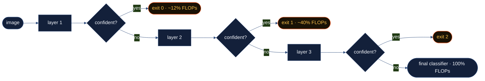

<p align="center">
  
</p>

<p align="center">
  <a href="https://github.com/sohams25/earlyon/actions/workflows/ci.yml"></a>
  
  
  
  
  <a href="LICENSE"></a>
</p>

<p align="center">
  <b>Skip the layers your images don't need.</b><br>
  <a href="#results-on-cifar-10">Results</a> ·
  <a href="#quick-start">Quick start</a> ·
  <a href="#models">Models</a> ·
  <a href="#cli">CLI</a> ·
  <a href="#how-it-works">How it works</a> ·
  <a href="#limitations">Limitations</a>
</p>

A deep network runs every layer for every image, even the obvious ones. A
frontal close-up of a car and a blurry, half-occluded bird both pay the full
forward pass. earlyon attaches lightweight classifier heads partway through the
network so confident predictions leave early and only the hard inputs go the
distance. Eight years of research show 1.3–2.5× less compute at single-sample
edge inference with the same accuracy. earlyon is the part you `pip install`
instead of re-implementing per paper.

```bash
pip install earlyon
```

```python
import torch
from earlyon.models import resnet50_ee

model = resnet50_ee(num_classes=10, pretrained=True).eval()
result = model(torch.randn(1, 3, 224, 224), mode="inference")

result.exit_taken        # which head fired (-1 = full network)
result.computation_used  # fraction of FLOPs actually run
result.confidence        # how sure it was when it left
```



---

## Results on CIFAR-10

Trained on an RTX 4050 Laptop GPU (6 GB) from ImageNet-pretrained weights:
3–4 stage-1 epochs + 3–4 stage-2 epochs, thresholds calibrated to a 1% target
accuracy drop.

| Model       | Test Acc | Baseline Acc | Avg FLOPs Used | % exited early |
|-------------|---------:|-------------:|---------------:|---------------:|
| ResNet18    |   94.42% |       96.32% |         89.88% |          35.3% |
| ResNet50    |   95.88% |       97.60% |     **81.42%** |      **58.2%** |
| MobileNetV2 |   93.31% |       95.08% |         93.90% |           8.5% |

> **Avg FLOPs Used is the honest signal**: the work skipped on real test
> images, not a theoretical ceiling. ResNet50 drops ~19% of its compute for a
> 1.7% accuracy cost, and **58% of images never reach `layer4`.** Wall-clock
> speedup depends on hardware and input mix; see the
> [latency appendix](#appendix-wall-clock-latency).

Where it wins, plainly: big models with expensive deep layers on a mix of
easy and hard inputs (ResNet50 ✅). Where it doesn't: small models whose
backbone is already cheap. MobileNetV2 on CIFAR-10 sends only 8% of images
out early, so the wrapper does ~94% of the work anyway. earlyon tells you
which case you're in.

Reproduce: `python scripts/run_benchmarks.py` (train + bench) ·
`python scripts/re_evaluate.py` (from checkpoints). Raw numbers in
[`docs/benchmarks.json`](docs/benchmarks.json).

---

## What you get

### 1 · Wrap a model you already use

One call turns a stock torchvision backbone into an early-exit network. ResNet,
MobileNetV2, EfficientNet, a CIFAR-native ResNet, or **ViT**, CNNs *and*
transformers, and `custom_ee` wraps **any** `nn.Module`, auto-inferring the
exit widths. The heads attach via forward hooks, so **no backbone forward is
rewritten** and your weights load unchanged.

### 2 · Train without changing your recipe

Two-stage is the default: train the backbone exactly as you do today, then
freeze it (parameters *and* BatchNorm stats) and train only the small exit
heads. No gradient conflict, and you can bolt exits onto an already-trained
model. Want peak accuracy instead? One call swaps in end-to-end **joint**
training.

### 3 · Dial the speed/accuracy tradeoff

The exits are governed by per-head thresholds. `calibrate_thresholds` greedily
finds the most aggressive thresholds that hold accuracy within a target drop you
choose (e.g. 1%), with optional temperature scaling to fix the over-confidence
modern CNNs are known for. Route on **confidence** or on **entropy**; both ship.

### 4 · Prove it on real hardware

Honesty is the whole point. The benchmark suite reports **average FLOPs
skipped on real test images**, plus throughput, latency percentiles with
proper CUDA sync, the per-class exit distribution, and NVIDIA Jetson
power/thermal profiling via `tegrastats`.

## How it compares

Early-exit papers publish custom code for one architecture. Compression
techniques shrink the model for every input. earlyon keeps the full model and
spends compute per image:

|  | earlyon | Per-paper research code | Pruning / distillation |
|---|---|---|---|
| Works on your existing backbone | ✅ hooks, no rewrite | ❌ one architecture each | ⚠️ retrain required |
| Adapts compute per input | ✅ easy images exit early | ✅ (that one model) | ❌ fixed cost for all |
| Full accuracy still reachable | ✅ hard inputs run everything | ✅ | ❌ capacity is gone |
| `pip install` + tests + CI | ✅ | ❌ | ✅ (mature tools) |
| Composable with compression | ✅ wrap a pruned model too | — | — |

Pruning and distillation are complementary, not rivals: wrap a compressed
backbone and stack both savings.

---

## Quick start

Install, wrap, train the heads, calibrate, measure:

```python
import torch
from earlyon.models import resnet50_ee
from earlyon.core.thresholds import calibrate_thresholds

model = resnet50_ee(num_classes=10, pretrained=True)

# 1. train the backbone exactly as you normally would (or start pretrained)
# 2. freeze it and train the exit heads — see examples/01_train_resnet50_cifar10.py

# 3. pick thresholds that hold accuracy within 1% of baseline
calibrate_thresholds(model, val_loader, target_accuracy_drop=0.01)

# 4. deploy
model.eval()
result = model(image, mode="inference")
print(result.exit_taken, result.confidence, result.computation_used)
```

The inference path runs under `torch.inference_mode()` for you; the returned
prediction carries no autograd graph, so it's safe in a server loop.

Batched routing (all samples in a batch exit together at the earliest layer
every sample clears):

```python
result = model.forward_inference_batched(x_batch)   # (N, 3, H, W)
result.exit_taken              # the layer everyone left at
result.per_sample_confidence   # tensor (N,)
```

Worked end-to-end scripts live in [`examples/`](examples/), including
[Jetson deployment](examples/02_jetson_deployment.py).

## Models

| Factory | Backbone | Exits |
|---|---|---|
| `resnet18_ee` | torchvision ResNet18 | 2 (after `layer2`, `layer3`) |
| `resnet50_ee` | torchvision ResNet50 | 3 (after `layer1`, `layer2`, `layer3`) |
| `mobilenetv2_ee` | torchvision MobileNetV2 | 2 (`features.3`, `features.10`) |
| `efficientnet_b0_ee` | torchvision EfficientNet-B0 | 2 (`features.3`, `features.5`) |
| `cifar_resnet_ee` | CIFAR-native ResNet (He et al. 2015) | 3 — 3×3 stem, no maxpool, native 32×32 |
| `vit_b_16_ee` | torchvision ViT-B/16 (transformer) | 2 (after encoder blocks 3 & 9) |

```python
from earlyon.models import resnet18_ee, vit_b_16_ee, cifar_resnet_ee

m1 = resnet18_ee(num_classes=10)
m2 = vit_b_16_ee(num_classes=100)                # transformer, token-pooled exits
m3 = cifar_resnet_ee(num_classes=10, depth=20)   # 6n+2 depth, no upsampling
```

### Wrap any model

`custom_ee` attaches exits to **any** `nn.Module` at named layers and
auto-infers each exit's width from one dry-run forward. CNN (4D) and
transformer (3D token) features both work:

```python
from earlyon.models import custom_ee

# `backbone` must already return (B, num_classes) logits
model = custom_ee(backbone, exit_layers=["layer2", "layer3"], num_classes=10)
```

## Routing policies

Set `routing_policy` on the config:

- **`"confidence"`** (default) — exit when `softmax(logits).max() >= threshold`.
- **`"entropy"`** — exit when `H(softmax(logits)) <= threshold` (low entropy =
  high certainty).

`calibrate_thresholds` is policy-aware; it calibrates whichever list the active
policy reads, and `save_wrapper`/`load_wrapper` round-trip the policy and both
threshold lists, so a calibrated entropy model reloads as an entropy model.

```python
from earlyon.core.thresholds import calibrate_thresholds

result = calibrate_thresholds(model, val_loader, target_accuracy_drop=0.01,
                              fit_temperature=True, temperature_loader=cal_loader)
print(result.policy, result.thresholds, result.fitted_temperature)
```

## Training strategies

| Strategy | Call | When |
|---|---|---|
| **Two-stage** *(default)* | `stage1_train_backbone` → `stage2_train_exits` | Add exits to any model; no gradient conflict |
| **Joint** | `joint_train_backbone_and_exits` | End-to-end, for peak accuracy with the compute budget |

## CLI

```bash
earlyon wrap --backbone resnet50 --num-classes 10 --output model.pth

earlyon train backbone --backbone resnet50 --num-classes 10 \
    --dataset cifar10 --epochs 90 --output backbone.pth
earlyon train exits --model backbone.pth --dataset cifar10 --epochs 20 --output ee.pth
earlyon train joint --model backbone.pth --dataset cifar10 --epochs 30 --output joint.pth

earlyon calibrate --model ee.pth --target-drop 0.01 --output calibrated.pth
earlyon benchmark --model calibrated.pth --device cuda --runs 500
earlyon profile   --model calibrated.pth --runs 200      # Jetson power + thermal
earlyon analyze   --model calibrated.pth                 # per-exit accuracy + distribution
earlyon export    --model calibrated.pth --output model.onnx   # static multi-exit ONNX graph
```

## How it works

1. **Forward hooks** attach exit heads at chosen layers; no backbone rewrite.
2. **Routing** computes the policy's criterion at each exit; when it's met, a
   sentinel exception short-circuits the rest of the backbone (the only reliable
   way to skip downstream layers from inside a hook). The whole path runs under
   `torch.inference_mode()`.
3. **Training** is two-stage (freeze backbone + BN, train heads) or joint.
4. **Temperature scaling** (Guo et al. 2017) is fit before calibration to undo
   systematic over-confidence.
5. **Calibration** sweeps a per-exit grid and keeps the most aggressive
   threshold that holds accuracy within your target drop.

The reasoning behind each of these choices is written up in
[`docs/DESIGN_DECISIONS.md`](docs/DESIGN_DECISIONS.md).

## Limitations

- **Batch size 1** for `forward(mode="inference")`; use
  `forward_inference_batched(x)` for per-batch routing.
- **No `torch.compile`** on the inference path; the conditional control flow is
  incompatible and the wrapper raises a clear error. Compile the raw backbone.
- **ONNX export is static-graph only.** `earlyon export` writes a portable graph
  that computes *all* exits (routing applied at runtime by the caller); the
  per-sample early-exit speedup itself isn't expressed in ONNX. Use the PyTorch
  wrapper when you need the actual compute saving.
- **No compute-budget routing yet.** Confidence and entropy ship today.

## Contributing

Bug reports, backbone requests, and benchmark results from your hardware are
all welcome. Start with [CONTRIBUTING.md](CONTRIBUTING.md); security reports go
through [SECURITY.md](SECURITY.md).

## Used By

Using earlyon in a project, product, or paper? Open a PR adding yourself here,
or say hi in an issue. Early adopters shape the roadmap.

## Citation

If earlyon helps your research, cite it:

```bibtex
@misc{earlyon,
  author       = {Soham},
  title        = {earlyon: production-ready early-exit inference for PyTorch CV models},
  year         = {2026},
  publisher    = {GitHub},
  howpublished = {\url{https://github.com/sohams25/earlyon}},
  note         = {Version 0.2.0}
}
```

## Acknowledgements

BranchyNet (Teerapittayanon et al. 2016) and the ACM 2024 early-exit survey
(10.1145/3698767) for the ideas; torchvision (BSD) for the backbones; fvcore for
FLOPs accounting. earlyon itself is MIT.

## Appendix: wall-clock latency

Throughput here uses a random-noise input that can trigger spurious early exits,
so treat it as a best-case upper bound. The honest signal is **Avg FLOPs Used**
above, measured on the real test set. RTX 4050 Laptop GPU, batch 1, 224×224,
50-iter warmup, 300 iters.

| Model       | Backbone p50 | Wrapper p50 (noise input) |
|-------------|-------------:|--------------------------:|
| ResNet18    |      1.32 ms |                   0.51 ms |
| ResNet50    |      2.81 ms |                   3.03 ms |
| MobileNetV2 |       TBD ms |                    TBD ms |

Reproducible via `scripts/re_evaluate.py`; raw per-run data in
[`docs/benchmarks.json`](docs/benchmarks.json).

## License

MIT — see [LICENSE](LICENSE).
